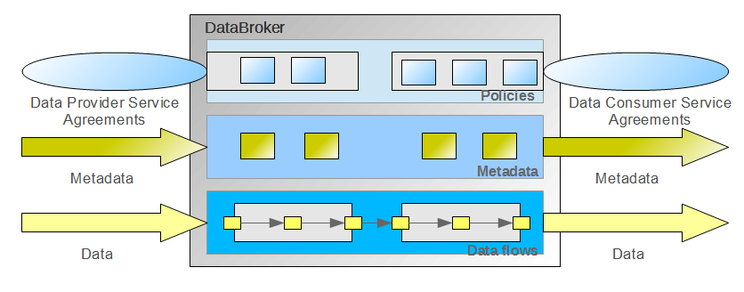

DataBroker
==========

DataBroker allows organizations to place data into the cloud, for storage, processing, analysis or presentation. The DataBroker also permits the sharing of data between organization in a structure and controlled manner.

License
=======

Copyright (c) 2013-2015, Arjuna Technologies Limited, Newcastle-upon-Tyne, England.

   Licensed under the Apache License, Version 2.0 (the "License");
   you may not use this file except in compliance with the License.
   You may obtain a copy of the License at

       http://www.apache.org/licenses/LICENSE-2.0

   Unless required by applicable law or agreed to in writing, software
   distributed under the License is distributed on an "AS IS" BASIS,
   WITHOUT WARRANTIES OR CONDITIONS OF ANY KIND, either express or implied.
   See the License for the specific language governing permissions and
   limitations under the License.
